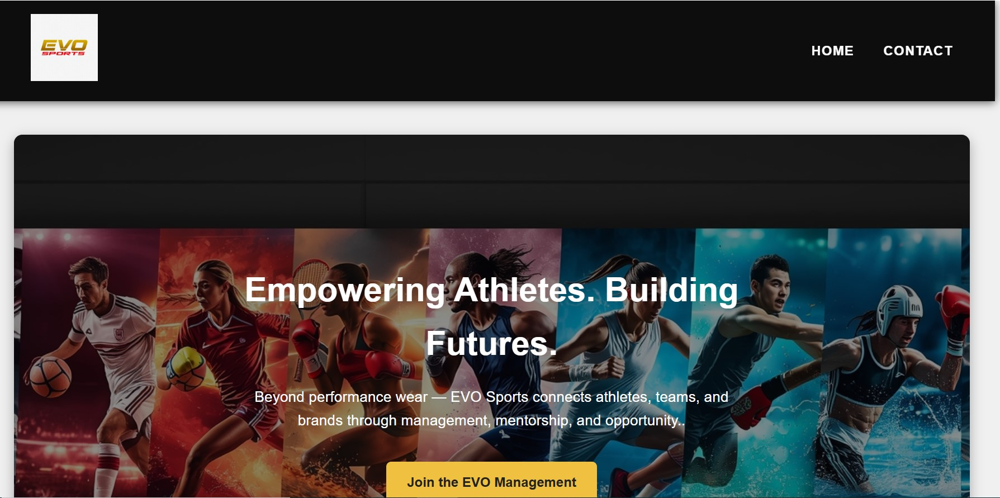
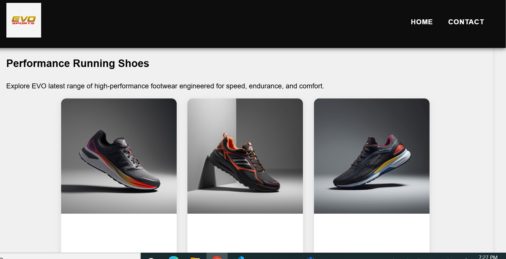
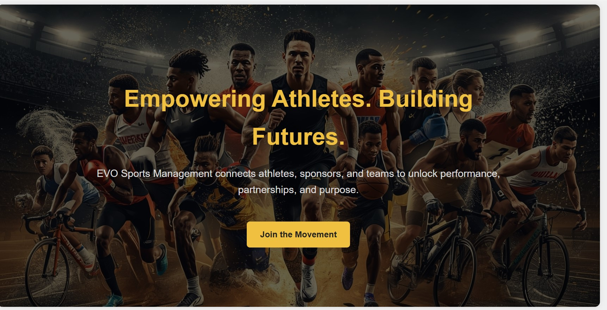
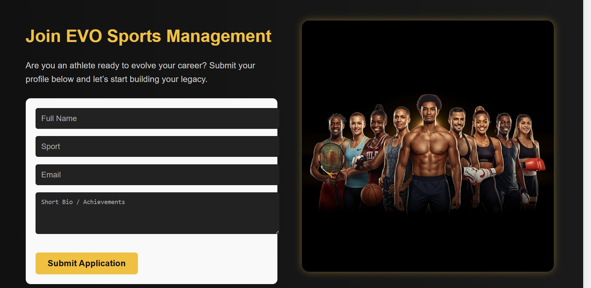

# EVO Sports Management Website

A responsive multi-page frontend project showcasing the design and structure of a sports management portal. This project demonstrates modern HTML and CSS practices, clean layout structure, and multi-page navigation. It is an evolving project — JavaScript interactions will be added in future versions.

---

## 🚀 Project Overview

This web project currently includes:

- **Home Page (`index.html`)**
  Hero banner, introduction, and visual brand layout.

- **Sports Management Page (`sportsmanagement.html`)**
  Concept design for athlete management and sports analytics.

- **Contact Page (`contact.html`)**
  Athlete application form and contact elements.

- **Global Styles (`styles.css`)**
  Organized CSS with hero sections, buttons, responsive layout, and navigation.

---

## 📸 Project Screenshots


### 🏠 Home Page  


---

### 👟 Sports Products Section  


---

### 🏅 Sports Management Hero Section  


---

### 📝 Join EVO Sports Management – Application Form  


---

## 📁 Folder Structure

```
EVO-Sports-Management/
│
├── index.html
├── sportsmanagement.html
├── contact.html
│
├── styles/
│     └── styles.css
│
├── images/
│     ├── evo_special.jpg
│     └── athlete_collage.jpeg
│
└── screenshots/
      ├── web_look1.jpg
      ├── web_look2.jpg
      ├── web_look3.jpg
      └── web_look4.jpg
```

---

## 🎨 Features Implemented

- Clean, modern, responsive UI  
- Multi-page website navigation  
- CSS animations and hover effects  
- Sports-brand themed layout  
- Athlete management application form  
- Organized folder structure for scalability  

---

## 📌 Future Enhancements (Planned)

- JavaScript interactivity for dynamic sections  
- Athlete search filter  
- Management dashboard simulation  
- Mobile-first redesign  
- Backend integration (Flask or Node.js)

---

## 🌐 Live Demo (GitHub Pages)


```
https://monterovincent.github.io/EVO-Sports-Management/
```

---

## 🛠️ Technologies Used

- **HTML5**
- **CSS3**
- **Responsive Web Design**
- **Git & GitHub**

---

## 👤 Author

**Ebube Okutalukwe**  
Software Development Student | SAIT  
Passionate about sports technology, web development, and building modern digital experiences.

---

## 📄 License
